# Fintech Banking System - Complete Architecture Blueprint

## Table of Contents
1. [System Overview](#system-overview)
2. [Dual Architecture Design](#dual-architecture-design)
3. [Microservices Architecture](#microservices-architecture)
4. [Database Design (PostgreSQL)](#database-design-postgresql)
5. [RBAC System for Bank Officers](#rbac-system-for-bank-officers)
6. [API Design](#api-design)
7. [Security Architecture](#security-architecture)
8. [AWS Services Integration](#aws-services-integration)
9. [Implementation Roadmap](#implementation-roadmap)

## System Overview

### High-Level Architecture

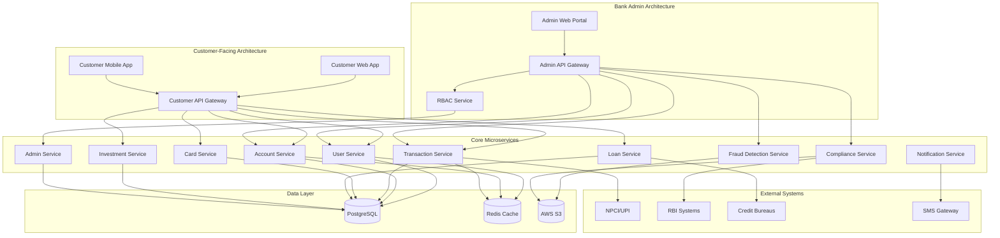

### System Characteristics
- **High Availability**: 99.99% uptime with multi-AZ deployment
- **Scalability**: Handle 10M+ customers, 1M+ daily transactions
- **Security**: PCI DSS Level 1, RBI compliance, end-to-end encryption
- **Performance**: <200ms API response time, real-time transaction processing
- **Consistency**: ACID compliance for financial transactions

## Dual Architecture Design

### Customer-Facing Architecture

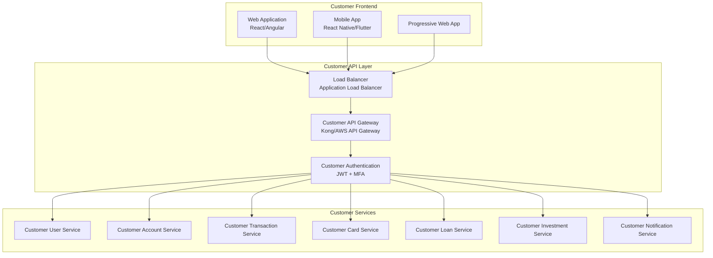

### Bank Admin Architecture

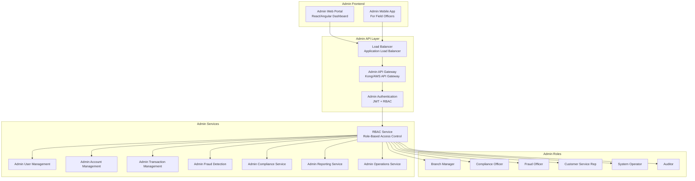

## Microservices Architecture

### Service Boundaries and Communication

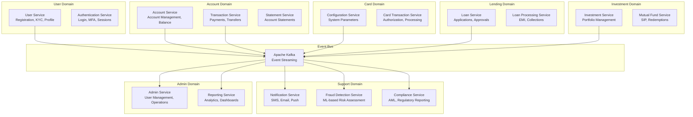

### Event-Driven Communication Patterns

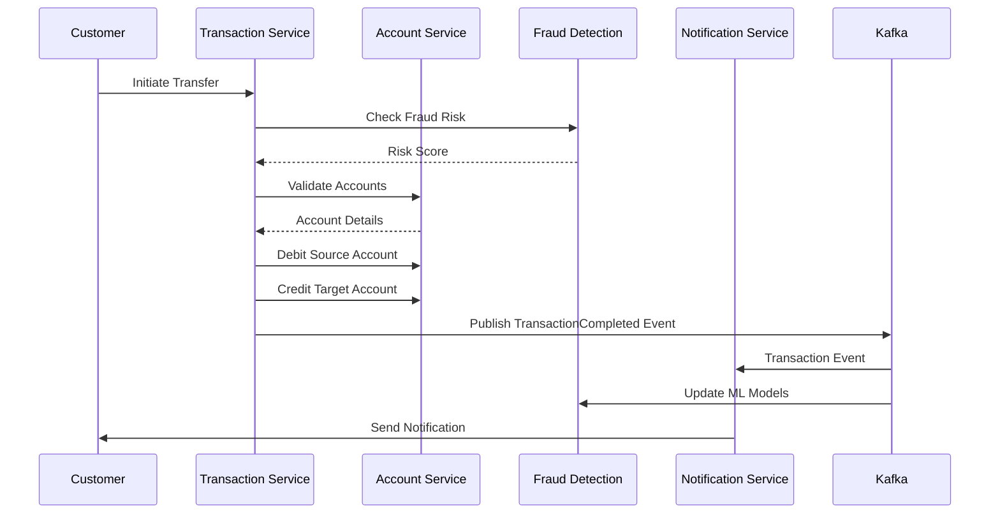

## Database Design (PostgreSQL)

### Database Schema Architecture

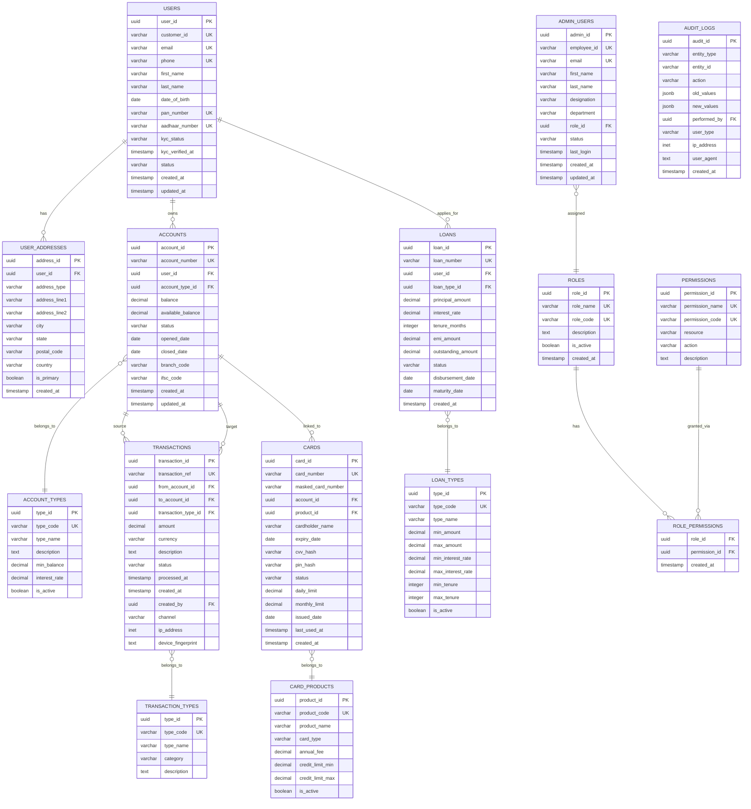

### PostgreSQL Specific Optimizations

```sql
-- Partitioning Strategy for Transactions (Monthly Partitions)
CREATE TABLE transactions_2024_01 PARTITION OF transactions
FOR VALUES FROM ('2024-01-01') TO ('2024-02-01');

CREATE TABLE transactions_2024_02 PARTITION OF transactions
FOR VALUES FROM ('2024-02-01') TO ('2024-03-01');

-- Indexes for Performance
CREATE INDEX CONCURRENTLY idx_transactions_account_date 
ON transactions (from_account_id, created_at DESC);

CREATE INDEX CONCURRENTLY idx_transactions_status_date 
ON transactions (status, created_at DESC);

CREATE INDEX CONCURRENTLY idx_users_customer_id 
ON users (customer_id);

CREATE INDEX CONCURRENTLY idx_accounts_user_status 
ON accounts (user_id, status);

-- Full-text search for transaction descriptions
CREATE INDEX CONCURRENTLY idx_transactions_description_fts 
ON transactions USING gin(to_tsvector('english', description));

-- Partial indexes for active records
CREATE INDEX CONCURRENTLY idx_users_active 
ON users (user_id) WHERE status = 'ACTIVE';

CREATE INDEX CONCURRENTLY idx_accounts_active 
ON accounts (account_id) WHERE status = 'ACTIVE';
```

## RBAC System for Bank Officers

### Role Hierarchy and Permissions

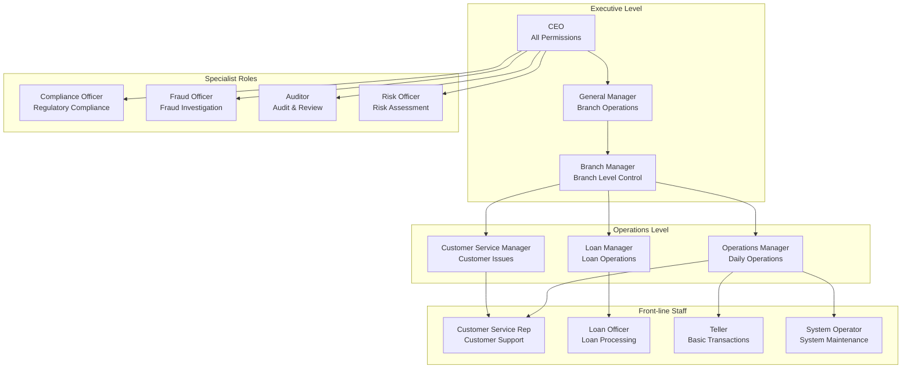

### Permission Matrix

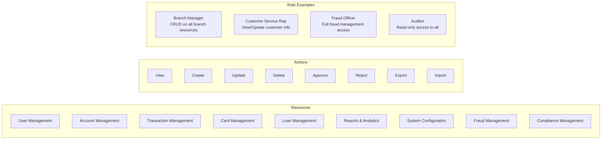

### RBAC Implementation Schema

```sql
-- Roles with hierarchy support
CREATE TABLE roles (
    role_id UUID PRIMARY KEY DEFAULT gen_random_uuid(),
    role_name VARCHAR(100) UNIQUE NOT NULL,
    role_code VARCHAR(50) UNIQUE NOT NULL,
    parent_role_id UUID REFERENCES roles(role_id),
    level INTEGER NOT NULL DEFAULT 1,
    description TEXT,
    is_active BOOLEAN DEFAULT TRUE,
    created_at TIMESTAMP DEFAULT CURRENT_TIMESTAMP
);

-- Permissions with resource-action mapping
CREATE TABLE permissions (
    permission_id UUID PRIMARY KEY DEFAULT gen_random_uuid(),
    permission_name VARCHAR(100) UNIQUE NOT NULL,
    permission_code VARCHAR(50) UNIQUE NOT NULL,
    resource VARCHAR(50) NOT NULL, -- users, accounts, transactions, etc.
    action VARCHAR(20) NOT NULL,   -- create, read, update, delete, approve
    description TEXT,
    created_at TIMESTAMP DEFAULT CURRENT_TIMESTAMP
);

-- Role-Permission mapping with conditions
CREATE TABLE role_permissions (
    role_id UUID REFERENCES roles(role_id),
    permission_id UUID REFERENCES permissions(permission_id),
    conditions JSONB, -- Additional conditions like branch_id, amount_limit
    granted_at TIMESTAMP DEFAULT CURRENT_TIMESTAMP,
    granted_by UUID REFERENCES admin_users(admin_id),
    PRIMARY KEY (role_id, permission_id)
);

-- Admin users with role assignment
CREATE TABLE admin_users (
    admin_id UUID PRIMARY KEY DEFAULT gen_random_uuid(),
    employee_id VARCHAR(20) UNIQUE NOT NULL,
    email VARCHAR(255) UNIQUE NOT NULL,
    first_name VARCHAR(100) NOT NULL,
    last_name VARCHAR(100) NOT NULL,
    designation VARCHAR(100),
    department VARCHAR(100),
    branch_id UUID, -- For branch-specific access
    role_id UUID REFERENCES roles(role_id),
    manager_id UUID REFERENCES admin_users(admin_id),
    status VARCHAR(20) DEFAULT 'ACTIVE',
    last_login TIMESTAMP,
    password_hash VARCHAR(255) NOT NULL,
    mfa_enabled BOOLEAN DEFAULT FALSE,
    mfa_secret VARCHAR(255),
    created_at TIMESTAMP DEFAULT CURRENT_TIMESTAMP,
    updated_at TIMESTAMP DEFAULT CURRENT_TIMESTAMP
);

-- Session management for admin users
CREATE TABLE admin_sessions (
    session_id UUID PRIMARY KEY DEFAULT gen_random_uuid(),
    admin_id UUID REFERENCES admin_users(admin_id),
    jwt_token_hash VARCHAR(255) NOT NULL,
    ip_address INET,
    user_agent TEXT,
    expires_at TIMESTAMP NOT NULL,
    created_at TIMESTAMP DEFAULT CURRENT_TIMESTAMP
);
```

## API Design

### Customer API Endpoints

```yaml
# Authentication APIs
POST   /api/v1/auth/register           # Customer registration
POST   /api/v1/auth/login              # Customer login
POST   /api/v1/auth/verify-otp         # OTP verification
POST   /api/v1/auth/refresh-token      # Token refresh
POST   /api/v1/auth/logout             # Logout
POST   /api/v1/auth/forgot-password    # Password reset

# Account Management APIs
GET    /api/v1/accounts                # List customer accounts
GET    /api/v1/accounts/{id}           # Get account details
GET    /api/v1/accounts/{id}/balance   # Get account balance
GET    /api/v1/accounts/{id}/statement # Get account statement
POST   /api/v1/accounts                # Create new account

# Transaction APIs
GET    /api/v1/transactions            # List transactions
GET    /api/v1/transactions/{id}       # Get transaction details
POST   /api/v1/transactions/transfer   # Fund transfer
POST   /api/v1/transactions/payment    # Bill payment
GET    /api/v1/transactions/beneficiaries # List beneficiaries
POST   /api/v1/transactions/beneficiaries # Add beneficiary

# Card Management APIs
GET    /api/v1/cards                   # List customer cards
GET    /api/v1/cards/{id}              # Get card details
POST   /api/v1/cards                   # Apply for new card
PUT    /api/v1/cards/{id}/status       # Block/unblock card
PUT    /api/v1/cards/{id}/limits       # Update card limits
GET    /api/v1/cards/{id}/transactions # Card transaction history

# Loan APIs
GET    /api/v1/loans                   # List customer loans
GET    /api/v1/loans/{id}              # Get loan details
POST   /api/v1/loans/apply             # Apply for loan
GET    /api/v1/loans/{id}/schedule     # EMI schedule
POST   /api/v1/loans/{id}/payment      # Make EMI payment

# Investment APIs
GET    /api/v1/investments             # Portfolio overview
GET    /api/v1/investments/funds       # Available mutual funds
POST   /api/v1/investments/sip         # Start SIP
GET    /api/v1/investments/transactions # Investment transactions
```

### Admin API Endpoints

```yaml
# Admin Authentication
POST   /api/v1/admin/auth/login        # Admin login
POST   /api/v1/admin/auth/mfa-verify   # MFA verification
POST   /api/v1/admin/auth/refresh      # Token refresh
POST   /api/v1/admin/auth/logout       # Admin logout

# User Management APIs (RBAC Protected)
GET    /api/v1/admin/users             # List customers
GET    /api/v1/admin/users/{id}        # Get customer details
PUT    /api/v1/admin/users/{id}/status # Update customer status
GET    /api/v1/admin/users/{id}/kyc    # KYC documents
PUT    /api/v1/admin/users/{id}/kyc    # Approve/reject KYC

# Account Management APIs
GET    /api/v1/admin/accounts          # List all accounts
GET    /api/v1/admin/accounts/{id}     # Account details
PUT    /api/v1/admin/accounts/{id}/status # Account status update
GET    /api/v1/admin/accounts/{id}/audit # Account audit trail

# Transaction Management APIs
GET    /api/v1/admin/transactions      # List all transactions
GET    /api/v1/admin/transactions/{id} # Transaction details
PUT    /api/v1/admin/transactions/{id}/status # Approve/reject transaction
GET    /api/v1/admin/transactions/suspicious # Flagged transactions

# Fraud Management APIs
GET    /api/v1/admin/fraud/alerts      # Fraud alerts
GET    /api/v1/admin/fraud/cases       # Fraud cases
PUT    /api/v1/admin/fraud/cases/{id}  # Update case status
GET    /api/v1/admin/fraud/patterns    # Fraud patterns

# Compliance APIs
GET    /api/v1/admin/compliance/reports # Compliance reports
POST   /api/v1/admin/compliance/aml    # AML report generation
GET    /api/v1/admin/compliance/audit  # Audit logs
POST   /api/v1/admin/compliance/ctr    # CTR report

# Analytics & Reporting APIs
GET    /api/v1/admin/analytics/dashboard # Dashboard metrics
GET    /api/v1/admin/analytics/transactions # Transaction analytics
GET    /api/v1/admin/analytics/customers # Customer analytics
POST   /api/v1/admin/reports/generate  # Generate custom reports

# System Configuration APIs
GET    /api/v1/admin/config/parameters # System parameters
PUT    /api/v1/admin/config/parameters # Update parameters
GET    /api/v1/admin/config/limits     # Transaction limits
PUT    /api/v1/admin/config/limits     # Update limits
```

## Security Architecture

### Authentication Flow

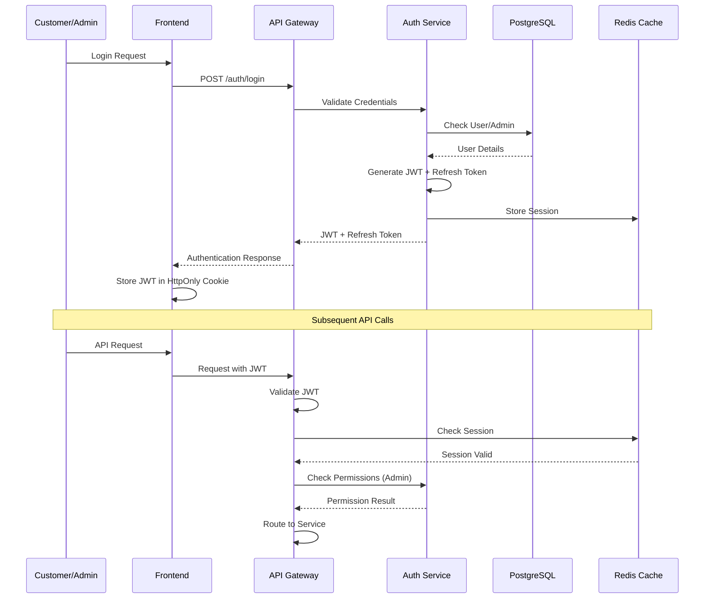

### Data Encryption Strategy

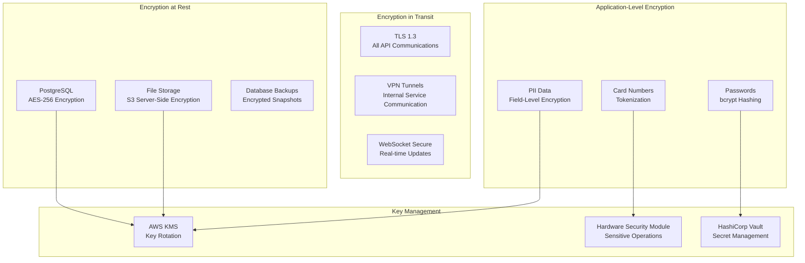

## AWS Services Integration

### Core AWS Services Stack

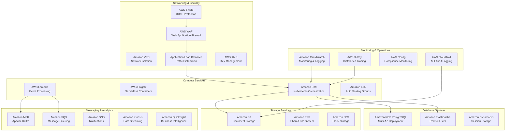

## Implementation Roadmap

### Phase 1: Foundation (Weeks 1-4)
- [ ] Set up AWS infrastructure (VPC, EKS, RDS)
- [ ] Implement basic PostgreSQL schema
- [ ] Create User Service with authentication
- [ ] Set up API Gateway and basic security
- [ ] Implement RBAC system for admin users

### Phase 2: Core Banking (Weeks 5-8)
- [ ] Implement Account Service
- [ ] Build Transaction Service with Saga pattern
- [ ] Create basic admin portal
- [ ] Implement fraud detection framework
- [ ] Set up monitoring and logging

### Phase 3: Advanced Features (Weeks 9-12)
- [ ] Implement Card Service
- [ ] Build Loan Service
- [ ] Create Investment Service
- [ ] Implement compliance and reporting
- [ ] Add real-time notifications

### Phase 4: Production Ready (Weeks 13-16)
- [ ] Performance optimization
- [ ] Security hardening
- [ ] Load testing and scaling
- [ ] Disaster recovery setup
- [ ] Production deployment

### Technology Stack Summary

**Backend Framework**: Spring Boot 3.x with Java 17
**Database**: PostgreSQL 15+ with Redis for caching
**Message Broker**: Apache Kafka (Amazon MSK)
**Container Orchestration**: Kubernetes (Amazon EKS)
**API Gateway**: Kong or AWS API Gateway
**Frontend**: React/Angular for web, React Native for mobile
**Security**: JWT tokens, OAuth 2.0, MFA
**Monitoring**: CloudWatch, X-Ray, ELK Stack
**CI/CD**: GitHub Actions or AWS CodePipeline
**Infrastructure**: Terraform for IaC

This blueprint provides a comprehensive foundation for building a production-ready fintech banking system with dual architecture, robust RBAC, and industry-standard security practices.
